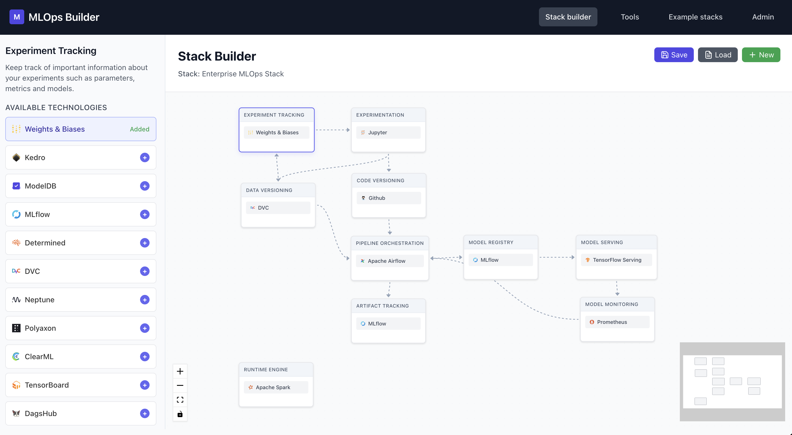

# MLOps Studio

**Build your perfect MLOps stack with an intuitive visual interface**

MLOps Studio is an interactive tool that helps data scientists and ML engineers design, visualize, and plan their Machine Learning Operations (MLOps) technology stack. Create custom workflows by connecting different stages of the ML lifecycle with the tools that best fit your needs.

## 🎯 Why MLOps Studio?

**For executives who love to talk about MLOps but have no idea what it actually is** - this tool finally gives you pretty pictures to go with your buzzwords! 📊✨

But seriously, MLOps Studio helps you _talk about_ the real problems:

- **Visualize the tool sprawl madness** - See all your potential ML tools in one place instead of scattered across 47 different vendor presentations
- **Plan before you build (maybe)** - Design your ML pipeline visually before your data scientists disappear into a 6-month "proof of concept"
- **Speak executive fluently** - Turn complex MLOps concepts into digestible flowcharts that look great in PowerPoint
- **Understand your vendor options** - Compare tools side-by-side so you can at least sound informed before signing that enterprise contract
- **Bridge the communication gap** - Help technical teams explain their architecture to stakeholders who think "pipeline" is something that carries oil

Think of it as **MLOps education with pretty diagrams**. Perfect for technical leaders who need to explain why MLOps isn't just "putting a model in production" and business stakeholders who want to understand what they're actually funding.

It won't build your MLOps platform for you, but it'll help you understand what one looks like and sound smart in meetings about it.



## ✨ Features

- **Visual Stack Builder**: Drag-and-drop interface for designing MLOps workflows
- **Comprehensive Tool Database**: 60+ pre-configured MLOps tools across all lifecycle stages
- **Custom Stages**: Create your own workflow stages and connections
- **Real-time Visualization**: Interactive flow diagrams powered by React Flow
- **Export & Share**: Save and load your MLOps stack configurations
- **Technology Details**: Rich information about each tool including use cases and integrations

## 🚀 Quick Start

### Prerequisites

- Node.js 18+
- npm or yarn

### Installation

1. **Clone the repository**

   ```bash
   git clone https://github.com/yourusername/mlops-studio.git
   cd mlops-studio
   ```

2. **Install dependencies**

   ```bash
   npm install
   ```

3. **Start the development server**

   ```bash
   npm run dev
   ```

4. **Open your browser**
   Navigate to [http://localhost:3000](http://localhost:3000)

## 🛠️ MLOps Stages Supported

- **Data Collection** - Gather and ingest raw data
- **Data Processing** - Clean, transform, and prepare data
- **Experimentation** - Research and prototype ML models
- **Training** - Train and tune production models
- **Model Registry** - Version and manage trained models
- **Model Serving** - Deploy models for inference
- **Monitoring** - Track model performance and data drift
- **Pipeline Orchestration** - Automate ML workflows

## 🏗️ Architecture

Built with modern web technologies:

- **Frontend**: Next.js 15 with React 18
- **Styling**: Tailwind CSS
- **Visualization**: React Flow
- **State Management**: React hooks with local storage
- **Testing**: Jest with React Testing Library
- **Code Quality**: ESLint, Prettier, Husky pre-commit hooks

## 📖 Usage

### Creating a Stack

1. **Add Stages**: Click the "Add Stage" button to create workflow stages
2. **Connect Stages**: Drag from one stage to another to create connections
3. **Add Technologies**: Click on any stage to browse and add relevant tools
4. **Customize**: Edit stage names, descriptions, and positions
5. **Save**: Export your configuration for future use

### Example Stacks

The application includes several pre-built example stacks:

- **Startup Stack** - Lightweight tools for small teams
- **Enterprise Stack** - Comprehensive enterprise-grade solutions
- **Research Stack** - Academic and experimentation-focused tools

## 🤝 Contributing

We welcome contributions! Please see our [Contributing Guide](CONTRIBUTING.md) for details.

This project is proudly supported by the [G-Research Open Source](https://gr-oss.io) team as part of our commitment to advancing open-source tools for the data science and machine learning community.

### Development Workflow

1. **Setup Development Environment**

   ```bash
   npm install
   npm run dev
   ```

2. **Code Quality**

   ```bash
   npm run quality        # Run all checks
   npm run lint          # ESLint
   npm run format        # Prettier
   npm run type-check    # TypeScript
   ```

3. **Testing**
   ```bash
   npm test              # Run tests
   npm run test:coverage # Coverage report
   ```

## 📝 License

This project is licensed under the Apache License 2.0 - see the [LICENSE](LICENSE) file for details.

## 🛡️ Security

Please see our [Security Policy](SECURITY.md) for reporting security vulnerabilities.

## 📊 Roadmap

- [ ] Export to infrastructure-as-code (Terraform, Docker Compose)
- [ ] Integration cost estimation
- [ ] Team collaboration features
- [ ] MLOps maturity assessment
- [ ] Tool recommendation engine based on requirements

## 🙏 Acknowledgments

- Tool information sourced from official documentation and community resources
- Icons provided by various open source projects
- Built with inspiration from the MLOps community

## 📞 Support

- **Issues**: [GitHub Issues](https://github.com/yourusername/mlops-studio/issues)
- **Discussions**: [GitHub Discussions](https://github.com/yourusername/mlops-studio/discussions)
- **Documentation**: [Wiki](https://github.com/yourusername/mlops-studio/wiki)

---

**Made with ❤️ for the MLOps community**
